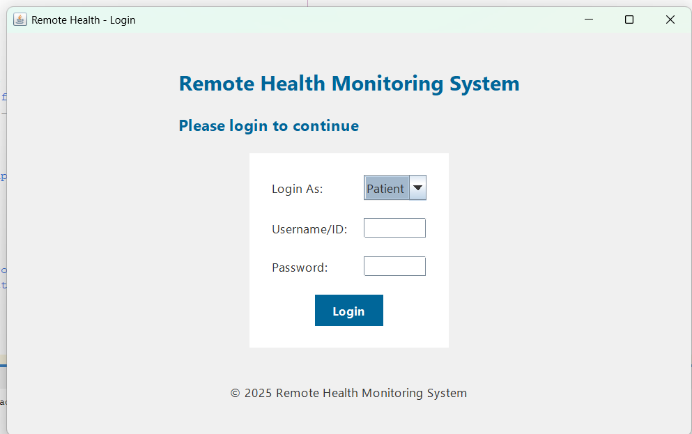

# 🏥 Remote Health Monitoring System (RHMS)

The **Remote Health Monitoring System (RHMS)** is a Java-based desktop application designed to provide remote healthcare support for patients and doctors. It features patient monitoring, appointment scheduling, emergency alerts, and doctor feedback—all managed through a user-friendly graphical interface.

---

## � Project Demo

📽️ [Click here to watch the demo video](https://drive.google.com/file/d/1_Z4883-4bn7Wy5HUKeP1XtepVf2mCoUE/view?usp=sharing)

---

## 🖼️ GUI Screenshot



---

## 💡 Features

- Patient and Doctor Login
- Vital Signs Tracking with Live Chart
- Appointment Scheduling and Approval
- Medical History & Feedback View
- Emergency Alerts via SMS & Email
- PDF Prescription Generator
- Reminder and Notification Services
- Modular Design using Java OOP Principles

---

## 🧑‍💻 Technologies Used

- Java (JDK 17+)
- Maven
- Swing GUI
- MySQL Database
- Twilio API (SMS Alerts)
- Jakarta Mail API (Email Notifications)
- JFreeChart (Vitals Visualization)
- Apache PDFBox (PDF Prescriptions)
- dotenv-java (Environment Variables)

---

## Installation Guide

This guide is beginner-friendly and intended for students in Grades 10–12.

### ✅ Prerequisites

Make sure the following are installed:

- [Java JDK 17 or later](https://www.oracle.com/java/technologies/javase/jdk17-archive-downloads.html)
- [Apache Maven](https://maven.apache.org/download.cgi)
- [MySQL Server](https://dev.mysql.com/downloads/mysql/)

Verify installation:
```bash
java -version
mvn -version
Setup Instructions
Follow these steps to set up and run the Remote Health Monitoring System (RHMS) on your local machine:

Clone the Repository

bash
git clone https://github.com/your-username/RemoteHealthMonitoringSystem.git
cd RemoteHealthMonitoringSystem
Configure MySQL Database

Open MySQL Workbench or your preferred client

Create a new database:

sql
CREATE DATABASE rhms_db;
Create required tables and insert test data (refer to your database schema if needed)

Create .env File
Create a file named .env in the root folder and add your configuration:

DB_URL=jdbc:mysql://localhost:3306/rhms_db
DB_USERNAME=root
DB_PASSWORD=your_password

TWILIO_ACCOUNT_SID=your_twilio_sid
TWILIO_AUTH_TOKEN=your_twilio_auth_token
TWILIO_PHONE_NUMBER=your_twilio_phone

EMAIL_USERNAME=your_email@gmail.com
EMAIL_PASSWORD=your_email_app_password
⚠️ Make sure not to share or upload this .env file to GitHub. It contains sensitive credentials.

Build the Project

bash
mvn clean install
Run the Application

bash
mvn exec:java
Maven Dependencies
The project uses the following Maven dependencies:

xml
<!-- Twilio (SMS alerts) -->
<dependency>
  <groupId>com.twilio.sdk</groupId>
  <artifactId>twilio</artifactId>
  <version>9.11.0</version>
</dependency>

<!-- SLF4J (Logging) -->
<dependency>
  <groupId>org.slf4j</groupId>
  <artifactId>slf4j-simple</artifactId>
  <version>2.0.9</version>
</dependency>

<!-- Jakarta Mail (Email sending) -->
<dependency>
  <groupId>com.sun.mail</groupId>
  <artifactId>jakarta.mail</artifactId>
  <version>2.0.1</version>
</dependency>

<!-- Jakarta Activation -->
<dependency>
  <groupId>jakarta.activation</groupId>
  <artifactId>jakarta.activation-api</artifactId>
  <version>2.1.1</version>
</dependency>

<!-- MySQL JDBC Connector -->
<dependency>
  <groupId>mysql</groupId>
  <artifactId>mysql-connector-java</artifactId>
  <version>8.0.33</version>
</dependency>

<!-- JFreeChart (Charts for vitals) -->
<dependency>
  <groupId>org.jfree</groupId>
  <artifactId>jfreechart</artifactId>
  <version>1.5.3</version>
</dependency>

<!-- Apache PDFBox (PDF generation) -->
<dependency>
  <groupId>org.apache.pdfbox</groupId>
  <artifactId>pdfbox</artifactId>
  <version>2.0.27</version>
</dependency>

<!-- dotenv-java (Environment variable loader) -->
<dependency>
  <groupId>io.github.cdimascio</groupId>
  <artifactId>dotenv-java</artifactId>
  <version>2.2.4</version>
</dependency>
Authors
Zayna Qasim

Iman Naeem

Shehryar Ali
